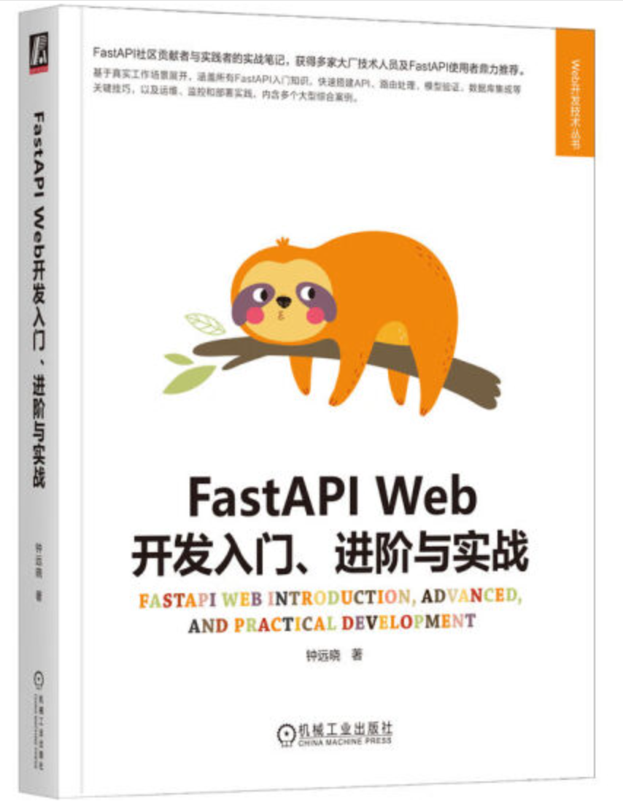

# fastapi_tutorial

#### 书籍封面

#### 介绍
本项目是FastAPI Web开发入门 进阶与实战 Web开发技术丛书 FastAPI Web开发入门教程书籍源码，

这是一本从实战角度介绍FastAPI web开发的入门与进阶型技术书。本书没有过多的理论介绍，完全从一线工作角度入手，介绍日常web开发需要掌握的相关知识。本

书共分为4篇16章：

第1篇是基础篇，主要介绍FastAPI的基础知识，包括FastAPI的基本信息、安装使用、常规操作、中间件、数据库相关内容。作为初学者，掌握这部分内容就可以快速上手使用FastAPI，处理各种日常问题。

第二篇是进阶篇，主要围绕与FastAPI相关的高级技能展开，包括异常处理、功能扩展、安全认证、性能、测试等相关内容。

第三篇是实战篇，主要从案例的角度对FastAPI在典型应用场景中的落地进行分享，包括短链应用、websocket、基于公众号的挂号系统等应用场景。

第四篇是部署篇，这部分重点介绍如何实现FastAPI的自动化部署，这数据高阶人员必备技能。本篇提供了三种自动化部署方式。

#### 数据目录内容
前言

第1章　初识FastAPI1

1.1　FastAPI框架概述1

1.1.1　FastAPI与其他Web框架2

1.1.2　FastAPI的特性2

1.2　异步编程基础4

1.2.1　并发编程机制4

1.2.2　并发与并行5

1.2.3　同步与异步6

1.2.4　阻塞与非阻塞6

1.3　asyncio协程概念7

1.4　asyncio协程简单应用8

第2章　初试FastAPI11

2.1　搭建开发环境11

2.1.1　安装Python语言包11

2.1.2　PyCharm的安装14

2.1.3　PyCharm IDE配置解析器15

2.1.4　PyCharm IDE解析器的切换18

2.1.5　PIP安装源的设置19

2.2　新建FastAPI项目22

2.2.1　新建简单项目22

2.2.2　项目依赖库的安装24

2.3　简单项目介绍27

2.3.1　创建app实例对象27

2.3.2　添加API请求路由注册28

2.3.3　添加后端渲染模板路由29

2.3.4　启动服务运行30

2.3.5　uvicorn参数说明34

2.3.6　查看交互式API文档35

第3章　FastAPI基础入门38

3.1　app应用配置参数详解38

3.1.1　开启Debug模式39

3.1.2　关于API交互式文档参数40

3.1.3　关闭交互式文档访问42

3.1.4　全局routes参数说明42

3.1.5　全局异常/错误捕获43

3.2　API端点路由注册和匹配44

3.2.1　路由节点元数据44

3.2.2　路由URL匹配46

3.2.3　基于APIRouter实例的

　　　　　 路由注册48

3.3　同步和异步API端点路由50

3.3.1　同步API端点路由50

3.3.2　异步API端点路由51

3.4　多应用挂载51

3.4.1　主从应用挂载52

3.4.2　挂载其他WSGI应用52

3.5　自定义配置swagger_ui53

3.6　应用配置信息读取55

3.6.1　基于文件读取配置参数55

3.6.2　基于Pydantic和.env环境变量

　　　读取配置参数56

3.6.3　给配置读取加上缓存58

3.7　API端点路由函数参数58

3.7.1　路径操作及路径函数59

3.7.2　Path参数59

3.7.3　Query参数63

3.7.4　Body参数67

3.7.5　Form数据和文件处理77

3.7.6　Header参数81

3.7.7　Cookie参数设置和读取83

3.8　请求报文85

3.8.1　Request对象85

3.8.2　更多Request属性信息86

3.9　响应报文87

3.9.1　HTTP状态码分类88

3.9.2　指定HTTP状态码89

3.9.3　使用response_model定义响应

　　　报文内容90

3.9.4　Response类型93

3.9.5　自定义Response类型98

3.10　后台异步任务执行99

3.11　应用启动和关闭事件100

第4章　FastAPI异常及错误102

4.1　HTTPException异常103

4.1.1　HTTPException简单源码分析103

4.1.2　HTTPException的使用104

4.1.3　覆盖HTTPException异常处理105

4.2　RequestValidationError错误106

4.2.1　RequestValidationError的使用106

4.2.2　覆盖RequestValidationError

　　　错误处理107

4.3　自定义异常108

4.3.1　自定义异常的实现108

4.3.2　自定义内部错误码和异常109

4.4　中间件抛出自定义异常110

第5章　Pydantic数据模型管理113

5.1　Pydantic介绍113

5.2　Pydantic的使用114

5.2.1　模型常见数据类型114

5.2.2　模型参数必选和可选115

5.2.3　模型多层嵌套116

5.2.4　模型对象实例化116

5.2.5　模型对象的转换117

5.2.6　模型对象的复制118

5.2.7　异常信息的捕获119

5.2.8　用Field()函数扩展更多复杂

　　　验证120

5.2.9　自定义验证器123

5.2.10　自定义验证器的优先级124

5.2.11　多字段或模型共享校验器125

5.2.12　root_validator根验证器126

5.3　Pydantic在FastAPI中的应用127

5.3.1　模型类和Body的请求127

5.3.2　模型类和依赖注入关系128

5.3.3　模型Config类和ORM转化130

第6章　FastAPI依赖注入机制详解133

6.1　依赖注入框架134

6.2　依赖项及其声明方式139

6.2.1　函数式依赖项140

6.2.2　类方式依赖项142

6.2.3　多个依赖项注入和依赖项

　　　传参143

6.3　多层依赖项嵌套注入144

6.4　多个依赖对象注入146

6.5　不同位置上的依赖项146

6.5.1　全局依赖项的注入147

6.5.2　路径操作依赖项的注入148

6.5.3　路由分组依赖项的注入149

第7章　FastAPI中间件151

7.1　HTTP请求中间件151

7.2　@app.middleware装饰器中间件152

7.3　CORSMiddleware跨域中间件155

7.3.1　跨域中间件的使用156

7.3.2　跨域中间件源码分析157

7.4　其他中间件161

7.4.1　 HTTPSRedirectMiddleware

　　　中间件161

7.4.2　TrustedHostMiddleware中间件162

7.5　自定义中间件164

7.5.1　基于BaseHTTPMiddleware

　　　自定义中间件164

7.5.2　日志追踪链路ID165

7.5.3　IP白名单中间件167

7.5.4　基于中间件获取响应报文

　　　内容168

第8章　数据库的应用170

8.1　数据库基础170

8.1.1　SQL概述170

8.1.2　SQL数据库170

8.1.3　NoSQL数据库171

8.2　Python操作SQLite数据库171

8.2.1　创建并链接到数据库172

8.2.2　游标对象操作数据172

8.3　ORM操作数据库173

8.4　SQLAlchemy库174

8.4.1　数据驱动异步和同步说明174

8.4.2　SQLAlchemy同步使用方式175

8.4.3　SQLAlchemy异步使用方式179

8.4.4　SQLAlchemy ORM反向生成

　　　模型184

8.5　SQLModel库185

8.5.1　SQLModel同步使用方式186

8.5.2　SQLModel异步使用方式188

8.6　在FastAPI中整合异步

　　SQLAlchemy处理190

8.6.1　需求分析和结构规划190

8.6.2　应用配置信息读取191

8.6.3　配置数据库引擎191

8.6.4　使用yield管理会话依赖项192

8.6.5　定义表模型192

8.6.6　表模型CRUD封装193

8.6.7　创建FastAPI实例并完成

　　　表创建194

8.6.8　定义对外可见的API195

8.6.9　完善对外可见的API195

8.6.10　Alembic数据库版本管理199

8.7　Redis数据库及aioredis使用201

8.7.1　连接Redis数据库202

8.7.2　Redis客户端对象实例化202

8.7.3　Redis基本缓存的应用203

8.7.4　Redis发布订阅的应用206

8.7.5　Redis分布式锁的应用208

第9章　安全认证机制211

9.1　OpenAPI规范211

9.2　基于标准HTTP的身份验证方案213

9.2.1　HTTPBasic基本认证方案213

9.2.2　HTTPDigest摘要认证方案215

9.3　基于APIKey的特定密钥方案221

9.4　基于OAuth 2的授权机制颁发

　　 令牌方案225

9.4.1　JWT组成结构225

9.4.2　JWT应用实践227

9.4.3　OAuth 2参数说明228

9.4.4　OAuth 2主体角色230

9.4.5　客户端模式230

9.4.6　密码模式237

9.4.7　授权码模式243

9.4.8　简化模式253

第10章　短链应用实战254

10.1　应用开发背景254

10.2　应用系统功能需求描述255

10.3　项目代码编写256

10.3.1　项目规划256

10.3.2　应用配置信息读取257

10.3.3　配置数据库引擎257

10.3.4　使用yield管理会话依赖项257

10.3.5　定义表模型258

10.3.6　用户信息表CURD封装259

10.3.7　短链信息表CURD封装260

10.3.8　创建FastAPI实例并初始

　　　　 化表261

10.3.9　创建测试账号262

10.3.10　定义短链重定向接口262

10.3.11　定义短链生成接口263

10.3.12　将子路由添加到根路由并

　　　　启动服务267

第11章　WebSocket+Vue简易聊天室

　　　　 实战269

11.1　WebSocket简介269

11.2　项目系统描述270

11.3　项目代码编写271

11.3.1　项目代码结构271

11.3.2　前端页面开发272

11.3.3　后端开发280

11.3.4　跨进程WebSocket通信290

第12章　预约挂号系统实战298

12.1　应用开发背景及系统功能需求299

12.2　项目框架结构规划300

12.3　使用路由分组模块化程序301

12.3.1　APIRouter参数说明302

12.3.2　APIRouter路由分组创建303

12.3.3　视图函数绑定303

12.3.4　APIRouter路由分组注册304

12.4　数据表模型设计304

12.4.1　数据库安装304

12.4.2　数据表设计308

12.4.3　模型类逆向生成310

12.4.4　数据库引擎配置313

12.5　后端项目基础框架搭建315

12.5.1　数据库配置315

12.5.2　定制统一API内容规范317

12.5.3　定制全局异常/错误处理320

12.5.4　基于中间件日志记录322

12.6　关键业务API实现334

12.6.1　微信登录授权334

12.6.2　获取首页医院信息337

12.6.3　获取医生列表信息340

12.6.4　获取医生排班信息341

12.6.5　获取排班信息详情345

12.6.6　订单提交并支付346

12.6.7　未支付订单再次支付353

12.6.8　微信支付回调357

12.6.9　历史预约详情列表接口361

12.6.10　其他业务接口说明361

12.7　超时订单处理362

12.7.1　消息队列说明362

12.7.2　AMQP介绍362

12.7.3　本地安装RabbitMQ364

12.7.4　RabbitMQ简单应用369

12.7.5　RabbitMQ死信队列371

12.7.6　订单超时后自动取消的实现373

12.8　同步转异步处理382

12.8.1　asgiref转换库介绍383

12.8.2　asgiref转换库应用383

第13章　基于Pytest的API测试385

13.1　Pytest简单应用385

13.1.1　unittest和Pytest的对比386

13.1.2　pytest.fixture装饰器的使用390

13.1.3　测试配置文件conftest.py395

13.2　用FastAPI进行API单元测试397

13.2.1　基于TestClient的单元测试397

13.2.2　基于Httpx的异步单元测试398

第14章　生产环境部署详解405

14.1　Linux服务器下部署应用程序405

14.1.1　分配具有root权限的

　　　　普通用户406

14.1.2　Linux系统上安装Python 3406

14.1.3　基于pyenv管理Python版本407

14.1.4　基于pipenv管理虚拟环境410

14.1.5　生成依赖项配置文件412

14.1.6　基于Gunicorn+Uvicorn的

　 　　　服务部署414

14.1.7　基于Supervisor的服务进程

　　　 管理416

14.1.8　基于OpenResty的反向代理419

14.1.9　PostgreSQL数据库的安装423

14.2　基于SVN自动化部署425

14.3　基于Docker进行服务部署427

14.3.1　Docker的安装和常用命令428

14.3.2　基于Dockerfile构建镜像430

14.3.3　Docker容器化部署与运行432

14.4　Docker下的环境变量433

14.4.1　基于OS标准库433

14.4.2　基于Pydantic中的BaseSettings

　　　　　　　自动绑定并解析环境变量434

14.4.3　Docker下的环境变量读取434

14.5　基于Docker Compose进行服务

　　　　　 编排436

14.5.1　多服务容器独立运行部署436

14.5.2　多Docker容器一键编排部署437

14.6　基于Gogs+Drone进行可持续

　　　　　 集成441

14.6.1　通过Gogs搭建自助Git服务441

14.6.2　通过Drone搭建持续集成和

　　　　　　　持续交付444

第15章　FastAPI实战常见问题454

15.1　依赖注入项的传参454

15.2　自定义插件开发456

15.2.1　插件模板基类的定义456

15.2.2　实现类似Flask钩子事件

　　　　　　　插件457

15.3　body重复消费引发阻塞问题460

15.3.1　阻塞问题复现460

15.3.2　解决方案462

15.4　全局request变量465

15.5　同步和异步相互转换467

15.5.1　asgiref转换包467

15.5.2　asyncer转换包469

15.6　Model响应报文的排序470

15.7　同步和异步邮件发送471

15.7.1　同步方式472

15.7.2　异步方式474

15.8　基于Jaeger实现分布式

　　　链路追踪476

15.8.1　分布式链路追踪的简单定义476

15.8.2　OpenTracing数据模型477

15.8.3　Jaeger介绍478

15.8.4　Jaeger安装和应用479

15.8.5　基于Jaeger SDK实现链路

　　　　　　　追踪480

15.8.6　FastAPI整合Jaeger SDK482

15.8.7　基于Jaeger SDK的跨服务

　　　　　　　链路统计486

15.9　基于Sentry实现错误信息收集489

15.9.1　Sentry安装和配置489

15.9.2　FastAPI框架中引入Sentry492

#### 使用说明

1.  源码对应的书籍相关章节
2.  下载后，导入相关IDE启动运行即可
3、 因个人知识及能力游侠，书籍内容难免有误，如遇问题，你可以联系我进行勘误订正。

